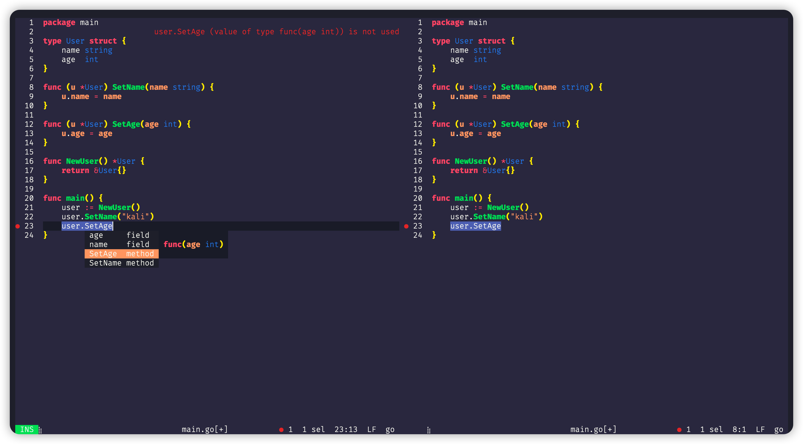

# Taffy High Contrast Theme for Helix Editor

## Screenshots



## Quick Start

```bash
git clone https://github.com/kalifun/taffy.git

mv themes ~/.config/helix/
```

You need to modify `~/.config/helix/config.toml`:

``` toml
theme = "taffy16"
```

## Scheme color


<table>
    <tbody align="center">
    <tr>
        <th>color name</th>
        <th>hex color</th>
        <th>color block</th>
    </tr>
    <tr>
        <td>baby-powder</td>
        <td><b>#fafffc</td>
        <td bgcolor="#fafffc" ></td>
    </tr>
    <tr>
        <td>dark-gunmetal</td>
        <td><b>#222533</td>
        <td bgcolor="#222533" ></td>
    </tr>
    <tr>
        <td>cinnabar</td>
        <td><b>#db4b3d</td>
        <td bgcolor="#db4b3d" ></td>
    </tr>
    <tr>
        <td>paradise-pink</td>
        <td><b>#dc435b</td>
        <td bgcolor="#dc435b" ></td>
    </tr>
    <tr>
        <td>dominant</td>
        <td><b>#36354d</td>
        <td bgcolor="#36354d" ></td>
    </tr>
    <tr>
        <td>french-lime</td>
        <td><b>#a7f547</td>
        <td bgcolor="#a7f547" ></td>
    </tr>
    <tr>
        <td>violet-blue</td>
        <td><b>#3f48c2</td>
        <td bgcolor="#3f48c2" ></td>
    </tr>
    <tr>
        <td>tufts-blue</td>
        <td><b>#448de7</td>
        <td bgcolor="#448de7" ></td>
    </tr>
    <tr>
        <td>banana-yellow</td>
        <td><b>#ffeb33</td>
        <td bgcolor="#ffeb33" ></td>
    </tr>
    <tr>
        <td>cadmium-orange</td>
        <td><b>#f58931</td>
        <td bgcolor="#f58931" ></td>
    </tr>
    <tr>
        <td>light-tangelo</td>
        <td><b>#ffab7b</td>
        <td bgcolor="#ffab7b" ></td>
    </tr>
    <tr>
        <td>ufo-green</td>
        <td><b>#2bdb72</td>
        <td bgcolor="#2bdb72" ></td>
    </tr>
    <tr>
        <td>english-red</td>
        <td><b>#a63d57</td>
        <td bgcolor="#a63d57" ></td>
    </tr>
    <tr>
        <td>begonia</td>
        <td><b>#ff6c7a</td>
        <td bgcolor="#ff6c7a" ></td>
    </tr>
    <tr>
        <td>glaucous</td>
        <td><b>#6275ba</td>
        <td bgcolor="#6275ba" ></td>
    </tr>
    <tr>
        <td>pale-cerulean</td>
        <td><b>#a3c0e6</td>
        <td bgcolor="#a3c0e6" ></td>
    </tr>
</table>

## Thanks To

inspired by [@PineTreePizza](https://twitter.com/PineTreePizza)